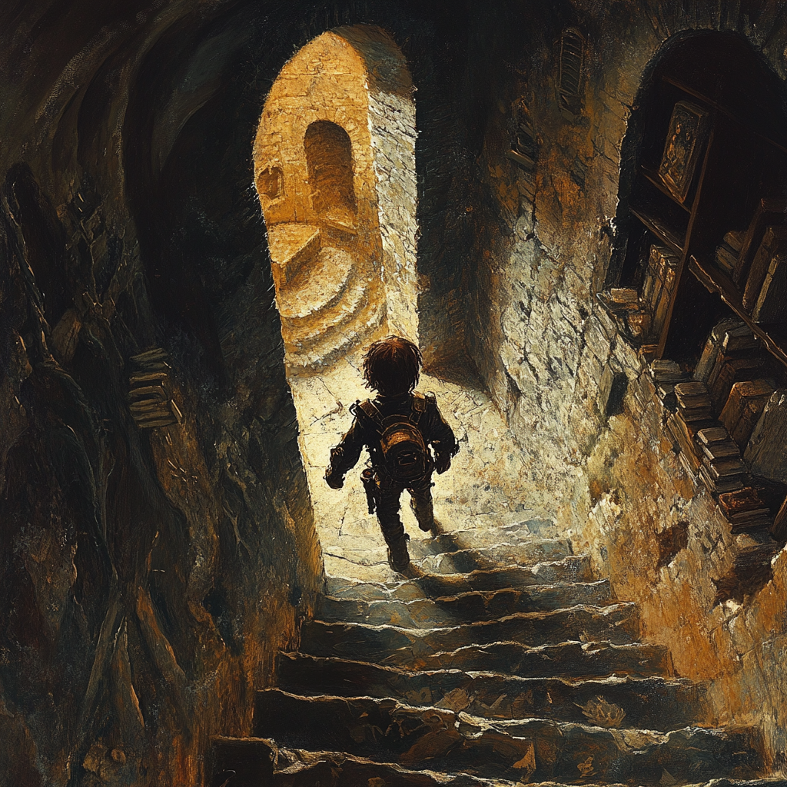

# Unraveling of the Longdale Lineage

## Sunday

### Secret Lair

#### Entrance

- Requires a hidden hand tattoo to unlock the door (no known spell yet, but suspected to be sealed with an arcane lock)

- One can create an entrance to the lair via any door inside of the school utilizing the tattoo for the **Society of Swords and Sorcery** Which all party members are now a part of.

#### Inside the Lair

- Nathan Hall is stationed inside the lair

_(Get picture of hideout)_

---

### Nathan Hall

#### Background

- Deacon's brother
- Member of the **Society of Swords and Sorcery** (the symbol carved onto the lair)

#### Current Events

- The party continues teasing Nathan by calling him a pedo, which makes him visibly uncomfortable
- Wields a heavy warhammer
- The party shared details with Nathan about the ancient sword and the discovery of the underground tomb
- Currently staying in town with Mrs. Historia
  - Mrs. Historia is a secret member of the **Society of Swords and Sorcery**

_(Get picture of Nathan Hall)_

---

### Society of Swords and Sorcery

#### Overview

- A private order sworn to protect the world without seeking riches or fame

#### Lore

- Volumes of ancient tales chronicling the legendary Longdales are on the wall
- Membership is sworn temporarily and will be expunged once Nathan resolves internal matters
- The **Longdale** family name was eventually transitioned to **Drake** through marriage

## Monday

### Mr. Yowyussi's Homeroom

#### Mr. Yowyussi

- A quirky gnome dressed in a kilt, enjoys yogurt he "liberated" from the faculty kitchen
- Ironically, Mr. Yowyussi does not know the school mottos history

#### Festival

- Despite recent field trip disasters, the school festival is still scheduled
  - Begins next Thursday and runs through Sunday, with standard fairground hours

#### School Motto

- _"Every Life is a Lesson"_

#### Strategy

- The new plan to lure Principal Drake to investigate the hole:
  - Tell him it is the location where Kirag and Lucia found me and hint it may hold great importance

_(Get picture of Mr. Y)_

---

### Principal Drake's Office

#### Meeting

- A meeting between Principal Drake and The Mayor is overheard through the door
  - Mr. Mayor pushes to keep the festival going despite safety concerns
  - The Mayor also expresses interest in shutting down the school permanently
- The Party informs Principal Drake of the Hole on the fair grounds
  - Principal Drake initially suggests alerting the police since the hole is not technically on school property

#### Outcome

- The group persuades **Principal Drake** to personally inspect the hole
- Principal Drake’s sister is revealed to be the school's Guidance Counselor

_(Get picture of Principal Drake)_

---

### Van Ride to the Hole

#### Conversation

- The party presses Principal Drake about his connection to the Longdales
- He admits that through marriage, the Longdale name became "Drake"
- He expresses pride in his ancient lineage

---

### The Hole

#### Observations

- The dirt surrounding the hole appears deliberately rearranged
- Principal Drake seems genuinely surprised about the hole meaning he did not know of its existence prior to the party bringing him there

#### Discovery

- The legendary sword is missing
- No traps or mummies triggered, indicating a Longdale descendant retrieved the artifact
- The party confirms they can report back to Principal Drake

---

### The Text Threat

#### Threat Received

- Every party member except me receives a chilling text:
  - _"If you do not wish for the same thing to happen to your family, that occured at the museum, stay out."_
- Included is a live feed of their families being watched

---

### Call From Nathan

#### Urgent Meeting

- Nathan urgently summons the group to the lair

#### Revelations

- Nathan dispels magic from the group using a gem, revealing:
  - Squeemus and Samwell had their memories modified during a visit to the Guidance Counselor
- Nathan advises consulting him before speaking again with Principal Drake

#### Zorschius Revealed

- The Party reveals the Cats True Nature as a Trickster God trapped in cat form and Nathan Strongly advises against making deals with the mischievous deity

## Thursday

### 5:40 PM Meeting with Zorschius the Cat God

#### Story Unfolds

- The party learns Zorschius' tale:
  - A wizard named **Azlo** imprisoned Zorschius in a cat's body for exploitation

#### Goal

- To break the curse, the group must outwit **Azlo** by playing his game
- A sunny day brightens the mood to the possible tragic events that may go forward

---

### The Cart's Awakening

#### Chaos

- The merchant cart rattles and shakes violently
- A CRT television bursts out with a glowing coin slot

#### Portal

- After inserting a coin, the party sees an aerial view of an island labeled **Doom Island** animate on the screen

---

### Doom Island

#### Simulation

- The television summons the party into a pocket dimension:
  - They find themselves aboard a helicopter, geared up for adventure
  - A blonde-mustached man briefs them on retrieving a powerful artifact
  - An explosion rocks the helicopter, causing the man to fall
  - The party blacks out as the helicopter spins out of control

---

To be continued...

