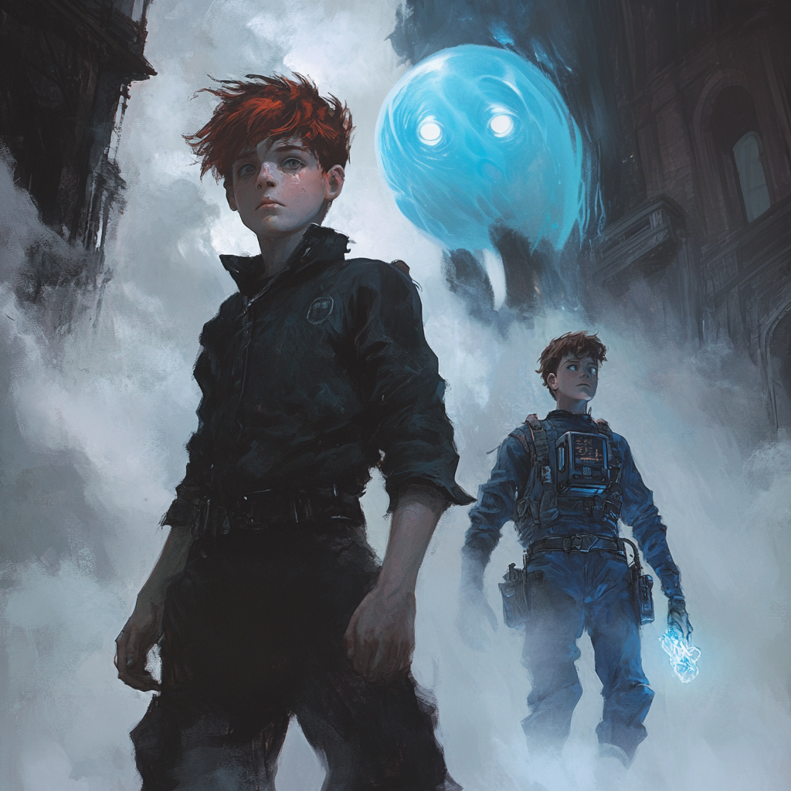

# Delving Doom Island

## Thursday (Continued)

---

### Doom Island

#### The Swamp

- I called upon `Mold Earth` to reshape the swamp, clearing the difficult terrain into something far more manageable for travel.

---

#### The Canopy

- We climbed the thick vines and found ourselves above the treetop canopy, the jungle stretching endlessly below.

##### Swinging Challenge

- Snakes began dropping from the trees without warning.
- `Kirag`, ever the showman, swung from a vine mid-air and snagged a falling snake in a whirling motion. Man of immense vigor
- `Sqweemus` wasn’t as lucky — a snake bit her mid-swing, and she plummeted, losing one of her three precious lives.
- `Samwell` fumbled too and lost a life in the fall.

---

#### Out of the Canopy and to the Rushing Waters

##### **Da Boat**

- We stumbled upon a boat calmly sitting on a raging river. Logic-defying, but welcome.

##### **Da Boat** on **Da Move**

- Once `we` boarded, it surged upriver like it belonged there.
- Strange creatures stirred in the water.
- **Da Boat** shifted between invisible lanes with every steer, reminding me more of a tavern game than a river journey.

##### Defend **Da Boat**

- The Creatures Identified as `Sahuagin` from previous research, launched themselves from the depths.
- `I` managed to knock one clean back into the water with a burst of wind from the `Gust Spell`
- **Da Boat** had 40 "fuel" or health points — yeah, that’s a thing now.
- Steering required effort each round.
- The `Sahuagin` started damaging the hull — and fast.
- `Kirag` was shoved into the water and instantly vanished. That’s when we learned the water meant certain death. He re-appeared in the stern of **Da Boat**

##### Health Standing

- `Kirag`: **2 lives**
- `Samwell`: **2 lives**
- `Sqweemus`: **2 lives**
- `Deacon`: **3 lives**
- `Lucia`: **3 lives**
- `Poppy`: **3 lives**
- `Herm (Me)`: **3 lives**

##### **Da Boat** Defense Continued

- `We` kept fending off wave after wave and navigating the chaos.
- The river blocked entirely at one point — we blew it apart. `I` hurled a pen through the last chunk like a true arcane warrior.
- **Da Boat** somehow scaled a vertical waterfall and glided smoothly into tranquil water at the summit.

---

#### Summit Waterfall — The Calm Waters

##### The Shore

- Lush, vibrant foliage surrounded us. Jungle paradise.
- Stonework and statues reminded me of old Civilization ruins.
- Serpent effigies loomed large — foreboding yet elegant.

##### The Pier

- **Da Boat** glided forward and docked itself as if summoned.

---

#### The Path to the Eye

- Text scrolled before us in mid-air: _"At the heart of the maze lies what you seek. Within the darkness lies the truth."_

---

#### Entering the Maze

- Dense fog covered our view. `Kirag` led.
- `Deacon, Sqweemus, and I` hung back while the others veered right.
- We split into two squads:
  - **Prodding Squad**: `Kirag, Poppy, Lucia, Samwell`
  - **Anchor Squad**: `Me (Herm), Deacon, Sqweemus`
- Then the rope between us went limp — `Azlo’s` meddling, no doubt.
- `The Parties` Then Gathered in Area the **Prodding Squad** Wandered To
- Inscriptions on the wall laid out details of people praising a flying creature. The wall shifted, revealing a hidden sanctum once they stood united.

---

#### The Sanctum

- Inside stood a massive, jeweled `Sahuagin`. The `Sahuagin` claimed `Azlo` cursed him to seek our blood.
- His blade ignited, and atop the totum pole sat a creature `I` couldn’t name
- `We` fought hard. Eventually, we brought him down. `He` thanked us as he faded.
- `Sqweemus` landed a perfect shot with the ballista, killing the lurking Creature before it could act.
- The Creature is identified as a `Wyvern` added to my Compendium

---

#### The Gem in the Eye Socket

- There was a `Red Gem` in an eye socket and the other eye socket was empty
- The `Red Gem` was oberved, but was set aside
- Acting on the earlier clue, `Lucia` reached into the petrified `Wyverns` eye socket and found a lump of coal.
- `Lucia`, ever impulsive, smashed it. Fog rolled in instantly, shrouding the sanctum.

---

### Back at the Entrance of the Cart

#### Rewards from Doom Island

- `We` awoke back at the cart. Only a minute had passed.
- A letter awaited: _"Congratulations! You solved cd the puzzle. Next time, tell the cat to be more careful who he tricks. I've left some trinkets and a hefty pile of gold scattered about."_ Then it turned to ash.
- We looted:
  - 350 Gold
  - `Boots of Striding and Springing` (Given to `Poppy`)
  - `Wand of Magic Missile` (Given to `Deacon`)
  - `Flame Tongue Trident` (Given to `Kirag`)

---

#### Zorcious Keeps His Promise

- `Zorcious` said someone is looking to open the `Dragons Hoard`
- `Zorcious` regained his full divine form and his powers will slowly come back over time
- `Zorcious` left us with an omen: **something terrible will happen on the final day of the festival.**

