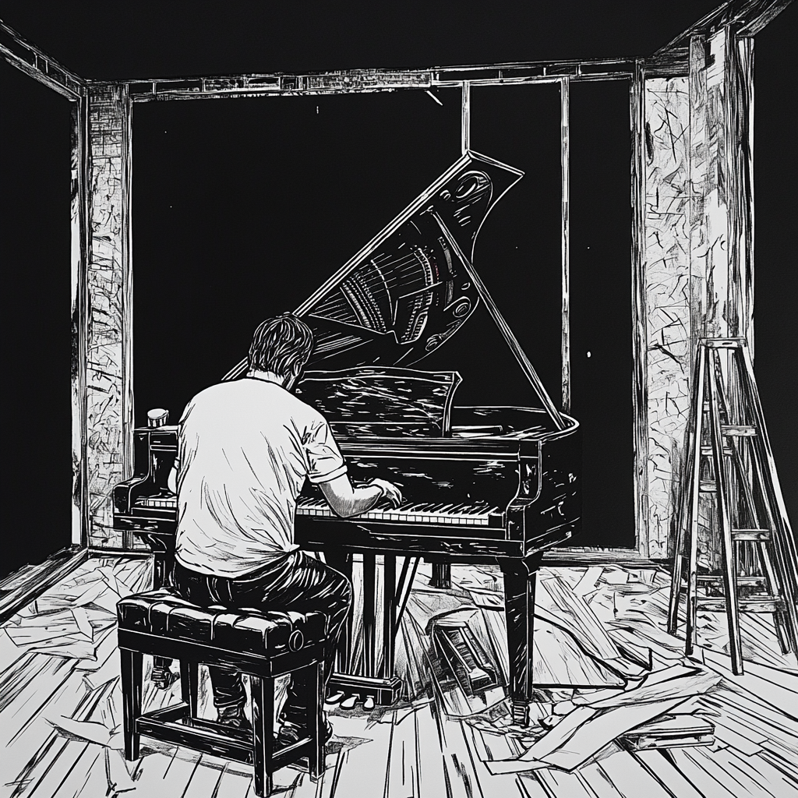

# Today's Endeavors

## 🎹 Piano Practice

- **Learning E Major Scale**  
  4 round training patterns:

  - Long Short
  - Short Long
  - Long Short Short Short
  - Short Short Short Long

- **Old Gray - I**  
  Fully learned, now focusing on repetition and technique.

- **Old Gray - II**  
  Learned half of the sheet music, working on completing the second half.

---

## 📓 [productiveJournal Repository](https://github.com/scondo-prof/productiveJournal)

- Created GitHub repository where this markdown file lives.
- Set up the first iteration of the directory structure and `readme.md` layout.

---

