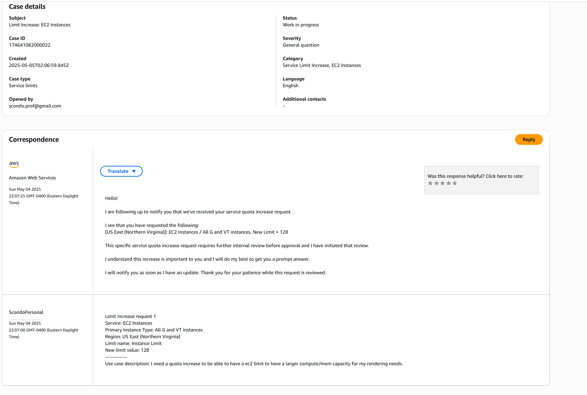

# Day of Coding and Cranking That Soulja Boy

## [theToolKit Repository](https://github.com/scondo-prof/theToolKit)

---

### `upload_s3_obj()` & `bulk_s3_upload()`

#### aiboto3 Implementation

Jamming to niminio’s [Creek Album](https://open.spotify.com/album/4wFyqyU8erSQITJyyoUOhk?si=zZrugydLRbeWFs3XlQWiAw) while diving deep into the ones and zeros.

##### Corrected Syntax

I used `aioboto3.Session` with `asyncio` to create an S3 client (`s3_client`). From there, all standard `boto3` calls executed asynchronously as intended.

##### Example Run

```powershell
(tools-env) PS C:\Users\scott\Documents\github\tools\tools\videographyTools> python .\s3_upload.py
Files gathered and ready for upload
---
Gathered File: C:\Users\scott\Documents\github\tools\tools\videographyTools\s3_upload.py
S3 Key: test/s3_upload.py
About to upload file with S3 key: test/s3_upload.py
Inside Catch
Session established
---
Gathered File: C:\Users\scott\Documents\github\tools\tools\videographyTools\youtube_to_mp3.py
S3 Key: test/youtube_to_mp3.py
About to upload file with S3 key: test/youtube_to_mp3.py
Inside Catch
Session established
---
Gathered File: C:\Users\scott\Documents\github\tools\tools\videographyTools\__init__.py
S3 Key: test/__init__.py
About to upload file with S3 key: test/__init__.py
Inside Catch
Session established
---
Gathered File: C:\Users\scott\Documents\github\tools\tools\videographyTools\videos\wow.txt
S3 Key: test/videos/wow.txt
About to upload file with S3 key: test/videos/wow.txt
Inside Catch
Session established
Successfully uploaded: test/__init__.py
Successfully uploaded: test/videos/wow.txt
Successfully uploaded: test/youtube_to_mp3.py
Successfully uploaded: test/s3_upload.py
```

---

#### Pull Request for Implementation

[Pull Request #12](https://github.com/scondo-prof/theToolKit/pull/12)

---

#### Pivot from `aiboto3` to `boto3`

[Commit 87744c4](https://github.com/scondo-prof/theToolKit/commit/87744c454162ff30969cf9fdf9814e7a6ee5c616)

---

## The Video Smoother

---

### File Upload

Using the `bulk_s3_upload` function made it seamless to upload the entire _Loons at Moose Pond_ Premiere project directory to S3.

#### Highlights

- The full project directory structure on S3 matches exactly what’s on my local machine.

---

### Rendering on EC2

#### Rendering the Uploaded Project Files

- The rendered output was suboptimal: playback remained jittery, likely due to remnants from prior renders.
- Attempted to de-render and re-render resulted in an encoding error

#### Upgrading the EC2 Instance

- Tried upgrading from a `g5.2xlarge` instance (**8 vCPUs**, **32 GiB RAM**, **24 GiB GPU Memory**) to a g5.8xlarge (**32 vCPUs**, **128 GiB RAM**, **24 GiB GPU Memory**), but hit AWS service quotas.

- Submitted a service quota increase request.



- Terminated the old EC2 instance. Will provision the new one once the quota is approved.

---


