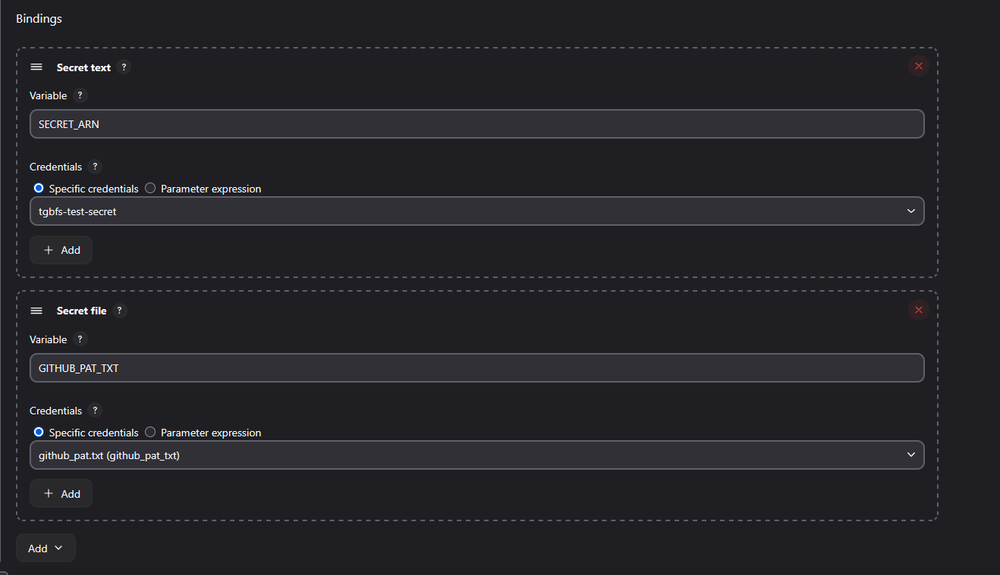

# Day of Mustaches and Melody

## CI/CD

### Jenkins & GitHub Actions Integration

#### Freestyle Job in Jenkins

- **Authentication Workaround**
  GitHub removed basic authentication, so I created a fine‑grained Personal Access Token for the test repository and stored it securely as a Jenkins credential.
- **Remote Build Trigger**
  Each job is configured with a trigger token. Jenkins uses its API key and this token to authenticate and initiate builds remotely.
  
- **Secure Environment Injection**
  Under **Build Environment**, enable **Use secret text(s) or file(s)** to inject the GitHub PAT and any other sensitive credentials into the build.
  
- **Build Steps**
  A single **Execute Shell** step pulls the latest code and launches the application:

  ```bash
  gh auth login --with-token < $GITHUB_PAT_TXT
  cd github/test-repo
  git checkout main
  git pull origin main
  . /home/ubuntu/miniconda3/etc/profile.d/conda.sh
  conda activate web-app-env
  pip install -r requirements.txt
  python main.py
  ```

#### Triggering Jenkins from GitHub Actions

- **Workflow Definition**
  A GitHub Actions workflow uses `curl` with Jenkins credentials to trigger the Jenkins job on each push to `main` or via manual dispatch:

  ```yaml
  name: Trigger Jenkins Job

  on:
    push:
      branches:
        - main
    workflow_dispatch:

  jobs:
    trigger-jenkins:
      runs-on: ubuntu-latest
      steps:
        - name: Trigger Jenkins via cURL
          run: |
            curl -X POST \
              -u "${{ secrets.JENKINS_USER }}:${{ secrets.JENKINS_API_KEY }}" \
              "http://<jenkins-elb-dns>:8080/job/www/build?token=test-repo"
  ```

- **Jenkins URL**
  Locate under **Dashboard > Manage Jenkins > System > Jenkins URL**.

- **Trigger Token**
  Matches the token defined in the job’s **Trigger builds remotely** configuration.

> **Outcome:** Commits to GitHub now automatically spin up Jenkins builds, and the Jenkins agents execute tasks securely within our AWS environment.

---

## Feeling the Felt

### Yale Billiards Session

#### Stroke Mechanics & Spin Control

I spent the evening honing my cue stroke and spin technique:

- **Spin Application**
  Adopting a lower stance made applying spin much smoother. While my accuracy wavered at first, my speed and cue control improved significantly.
- **Elbow Positioning**
  I noticed my arm wobbling on full strokes. Raising my elbow slightly and engaging only my pivot arm stabilized my motion.
- **8‑Ball Break Strategy**
  Emulated Efren Reyes’ break:

  - Align close to the second diamond along the left rail.
  - Strike the object ball just behind the head ball, causing a rebound into the rack.
  - This method often sends the 8‑ball into a side pocket for an early win.

#### Practice Drill

- Rack up eight ball game in a standard triangle formation.
- Focus on any single ball(could be stripe, solid, or 8): line up, execute a smooth stroke, and observe shot placement.
- Repeat, adjusting body alignment and stroke speed for consistency.

> **Next Steps:**
>
> - Track pocketed balls and break patterns in a simple log to quantify improvement.
> - Experiment with varying cue ball positions and break angles.

---

_Why was the billiard instructor a great teacher?_

_He knew how to chalk it up to experience!_

---


