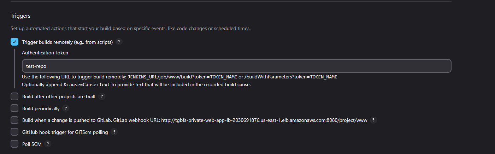

# Day of Mustaches and Melody

#### Node Agent Configuration

- **SSH‑Based Node:** Added the TGBFS web‑app server as a Jenkins agent via SSH.
- **Security Group Alignment:** The web‑app security group permits SSH (port 22) only from the Jenkins server’s security group.
- **Credentials Management:** The PEM key for the web‑app server is securely stored in Jenkins credentials.
- **Tag‑Driven Workload:** Jenkins projects tagged to match agent tags will execute builds on that agent.

#### GitHub CI/CD via Freestyle Job

- **Authentication Challenge:** GitHub deprecated basic auth, so we generated a Fine‑Grained PAT for the TGBFS repo and stored it as a Jenkins secret.
- **Remote Build Trigger:** Jobs are configured with a trigger token; authenticated via Jenkins API key to start builds remotely.
  
- **Secure Environment Injection:** Check **Use secret text(s) or file(s)** in job configuration to inject the PAT and other credentials.
  
- **Build Steps:** An **Execute Shell** step runs a script to pull from GitHub and launch the application:

  ```bash
  gh auth login --with-token < $GITHUB_PAT_TXT
  cd github/test-repo
  git checkout main
  git pull origin main
  . /home/ubuntu/miniconda3/etc/profile.d/conda.sh
  conda activate web-app-env
  pip install -r requirements.txt
  python main.py
  ```

#### GitHub Actions → Jenkins Trigger

- **Workflow YAML:** A GitHub Actions workflow uses `curl` with Jenkins credentials to trigger the Jenkins job when code is pushed or manually dispatched:

  ```yaml
  name: Trigger Jenkins Job

  on:
    push:
      branches:
        - main
    workflow_dispatch:

  jobs:
    trigger-jenkins:
      runs-on: ubuntu-latest
      steps:
        - name: Trigger Jenkins via CURL
          run: |
            curl -X POST \
              -u "${{ secrets.JENKINS_USER }}:${{ secrets.JENKINS_API_KEY }}" \
              "http://your-elb-dns:8080/job/www/build?token=test-repo"
  ```

- **Jenkins URL:** Found under **Dashboard > Manage Jenkins > System > Jenkins URL**.
- **Trigger Token:** Matches the token specified in the job’s **Trigger builds remotely** field.

_This setup enables seamless CI/CD: GitHub commits automatically kick off Jenkins builds, and Jenkins agents execute workloads securely within the AWS environment._

---
