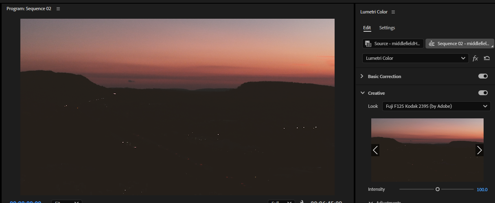
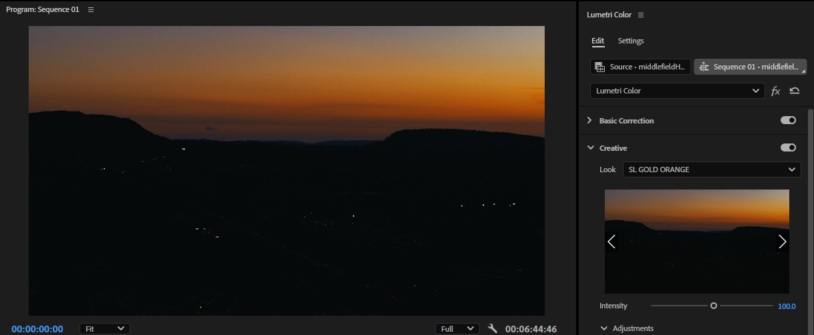
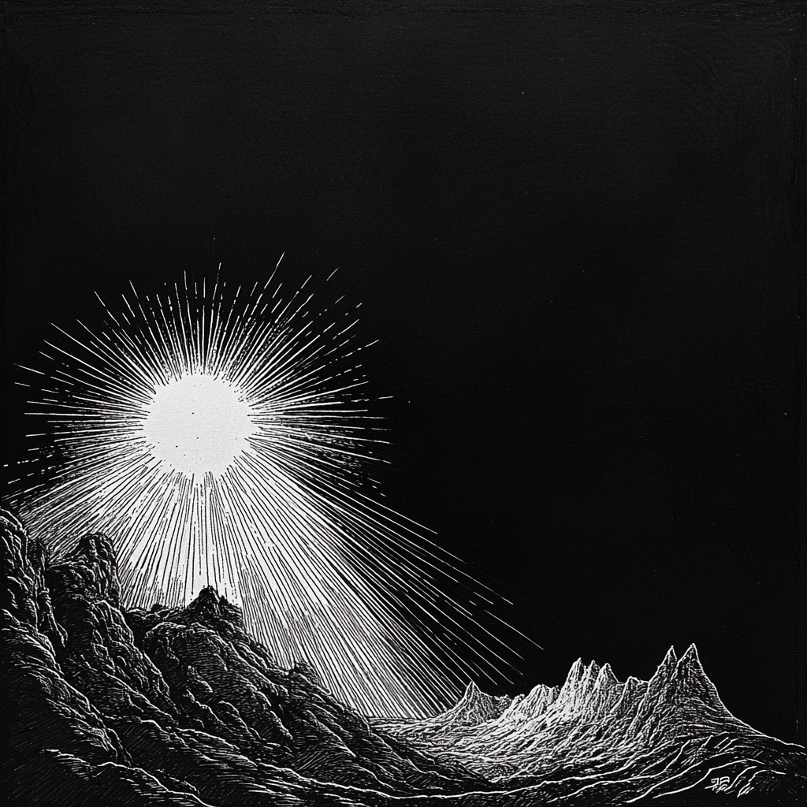

# Day of the River of Light

## The Premiere

### Nightfall Along Mt. Higby

#### Concept & Mood

A static, wide shot that frames the highway as it winds around Mt. Higby at sunset. As the sun dips below the horizon, the composition highlights the steady stream of headlights against the darkening mountain silhouette, evoking a sense of time slipping by.

#### Timing & Playback Speed

To compress six minutes of real-time motion into a compelling clip without looking too surreal, playback will be set to **180% speed**—fast enough to accentuate the dynamic flow, yet still maintain a natural rhythm.

#### Color Grading & Lumetri Presets

I experimented with several Lumetri Creative Looks. Two standout options include:

**Fuji F125 Kodak 2395 (Adobe)**

**SL Gold Orange**

> _Sometimes I forget how beautiful mountains are..._

> _I always take them for granite._

---

