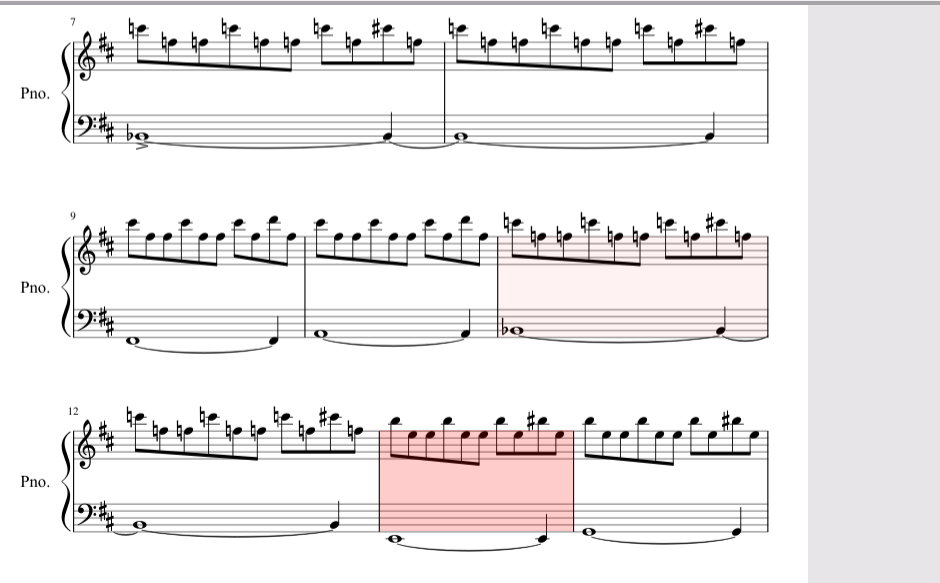
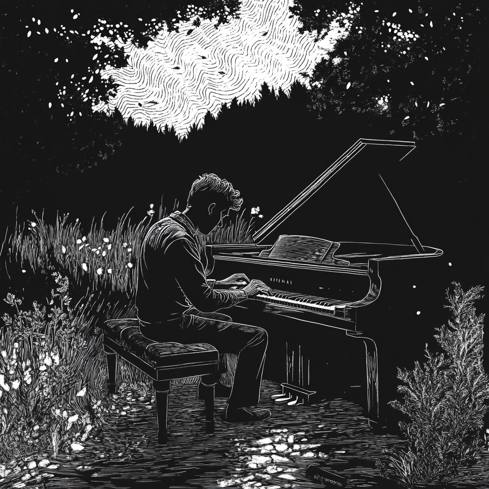

# Day of Slapping Pavement and Semibreves

## Spraying Albuterol and Acquiring Stamina

### Outdoor Run

- Completed an outdoor route of approximately 2 miles
- Maintained full-leg extensions and an open running posture
- Took five short breaks to catch my breath and refine form
- Closed the session with a powerful all-out sprint, leaving me breathless in the best way

---

## Tickling the Ivories, Not the Ovaries

### "I" by Old Gray

- Confidently played through the entire piece at tempo
- Focused on dynamic key strikes to convey the song’s emotional peaks and valleys

### "II" by Old Gray

- Nailed the first ten measures with consistency
- Encountering difficulty in measures 11–16 where the left-hand pattern shifts and the right hand leaps across notes on the pointer, middle, and ring fingers
- Next steps:

  1. Practice hands-separately at 60% speed
  2. Use a metronome to gradually increase tempo
  3. Reinforce muscle memory with repeated, targeted drills

### Michael Myers’ Theme

- Learned the initial chord progression cleanly
- Struggle Point: the rapid hand movements and wide stretches in the measure shown below
- Strategy:

  1. Isolate the challenging measure
  2. Play slowly with a metronome set to a manageable tempo
  3. Gradually ramp up speed by 5% increments, focusing on precision before tempo

---

