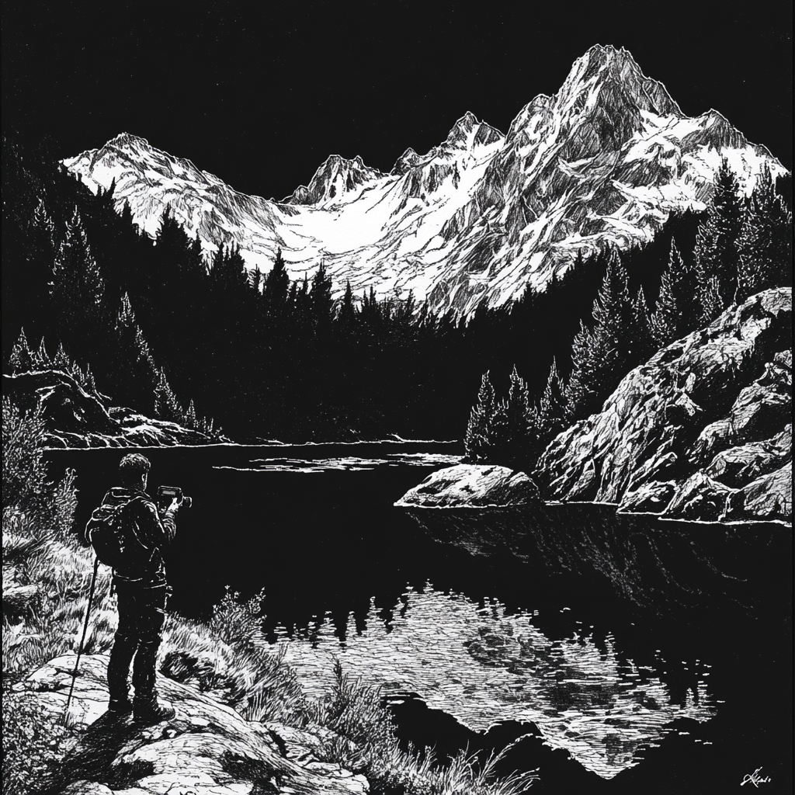

# Day of Westward Observation

## thePremier

### westCoastBeauty

**Project Title:** `westCoastBeauty` (working name)

#### Video Collection

- Reviewed all raw footage and hand‑picked serene clips from our journey to Mount St. Helens.
- Combined GoPro and Mavic 3 Pro footage; GoPro clips will require stabilization and smooth transitions.

#### Song Selection

- Evaluating classical piano pieces with a steady motif and evolving tempo—ideal for seamless cross‑fades and emotional pacing.

#### Base Adobe Creative Filter

- **SL Gold Orange**: Warm, airy look—adds lightness but can exaggerate rain artifacts.
- **SL Neutral Start**: Clean, crisp tonality with a subtle melancholic tint—enhances nature’s moodiness.

---

### pittsburgAdventureSports

**Project Title:** `pittsburgAdventureSports` (working name)

#### Video Collection

- Compiled FPV GoPro footage from our trip to Pittsburg Adventure Sports, capturing dynamic aerial stunts and course runs.

#### Song Selection

- Considering a laid‑back R\&B/jazz‑lounge track: moody, bass‑driven, and relaxed to match the footage’s kinetic energy.

#### Base Adobe Creative Filter

- **SL Blue Cold**: Cool, subdued palette—pairs well with a lounge‑style track and emphasizes a sophisticated, underground jazz vibe.

---

