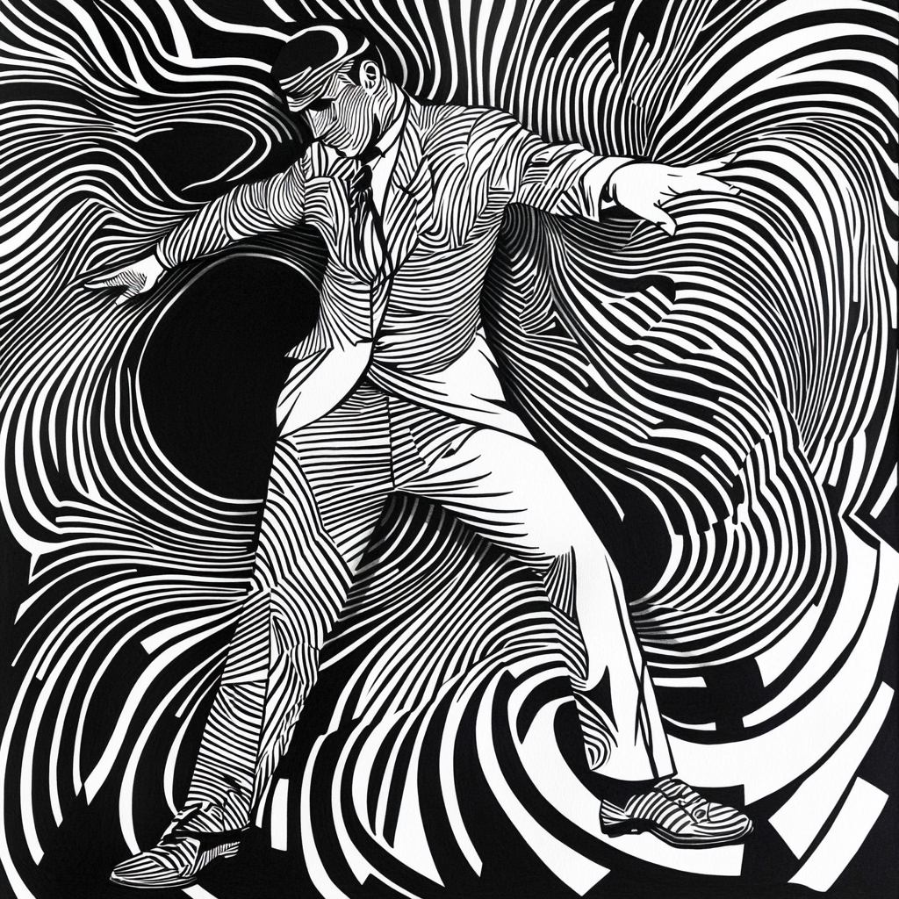

# Day of Smoothin and Groovin

## Spraying Albuterol and Acquiring Stamina

### Progress

Ran the 2 mile route again after the weekend break. Took 3 stops for completion

### Takeaways

endured good amounts of cramping and asthma. Key notes are hydration and stretching

## thePremier

### westCoastBeauty

#### Video Preparation

Smoothed all the GoPro footage and have it primed for the project

### pittsburgAdventureSports

#### Song Selection

Listened to Noir Styled Jazz and thought it was pretty groovy. Some of that genre have really good dark styled bass lines that are medium tempo that would be perfect for the ambience of that video. Need to find some royalty free music that matches that energy

