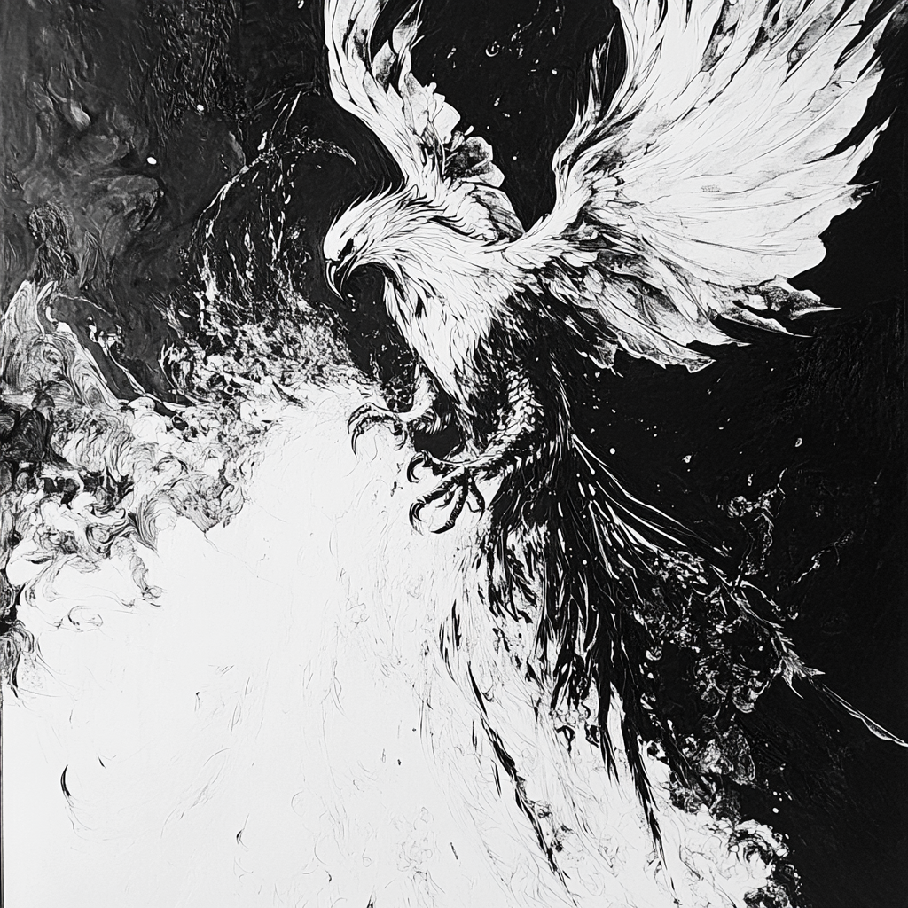

# Day of the Phoenix

## The Premiere

### Venture to Mount St. Helens

#### Rendering and Production

The Adventure Sports FPV flight video exported smoothly on the Rendering EC2 Machine but stuttered in YouTube’s browser player. This is likely due to the high frame rate and bitrate of the original footage. I attempted the YouTube 4K preset, but the uploader defaulted to 2K, which noticeably degraded image clarity. To optimize playback compatibility without sacrificing quality, I plan to:

- **Match Original Resolution:** Retain UHD (3840×2160) output when possible.
- **Reduce Frame Rate:** Lower from 120 fps to around 50 fps to ease browser decoding.
- **Adjust Bitrate:** Experiment with custom H.264/HEVC bitrates to balance smooth motion against file size.
- **Test Encoding Profiles:** Compare results using different encoder presets (e.g., slow vs. medium) to minimize artifacts.

Implementing these tweaks should yield a video that remains crisp and fluid both locally and on streaming platforms.

---

## GitLab

### Secure SSH Access

#### Authentication Workflow

When connecting to a private GitLab instance through a VPN, follow this procedure for reliable SSH authentication:

1. **Activate the VPN:**
   Ensure your VPN client is connected to the corporate network before any SSH attempts.

2. **Follow These Steps:**
   [`Steps`](https://docs.gitlab.com/user/ssh/)

3. **Validate the Connection:**
   Rather than a generic host key lookup, test by cloning a known repository:

   ```bash
   git clone git@gitlab-internal:group/repo.git
   ```

   A successful clone verifies both network and key-based authentication.

---


